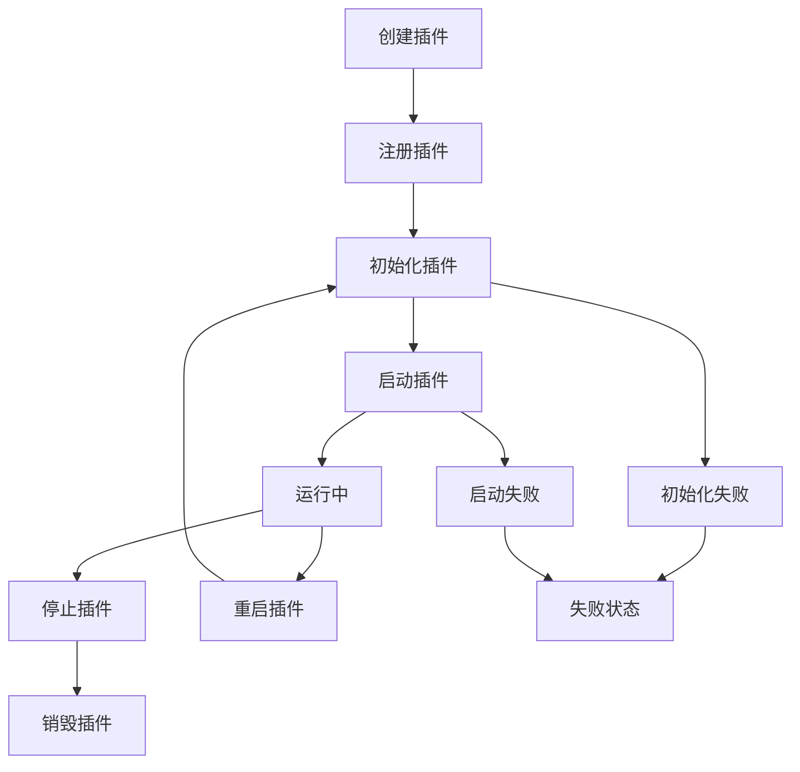

# 🧩 插件化架构系统

## 📋 概述

本项目实现了一个完整的插件化架构系统，支持动态插件管理、事件驱动通信、依赖解析和生命周期管理。该架构将现有的分布式服务组件（Redis Cluster、Kafka、Etcd等）转换为可插拔的模块，提供了高度的可扩展性和模块化能力。

## 🏗️ 核心架构

### 1. 核心组件

| 组件 | 描述 | 职责 |
|------|------|------|
| **Plugin接口** | 插件核心接口 | 定义插件生命周期和基本信息 |
| **PluginManager** | 插件管理器 | 管理插件的加载、初始化、启动、停止 |
| **PluginRegistry** | 插件注册表 | 插件注册、查找、依赖管理 |
| **EventBus** | 事件总线 | 插件间通信和事件传播 |
| **ConfigProvider** | 配置提供者 | 插件配置管理 |
| **PluginFactory** | 插件工厂 | 动态创建插件实例 |

### 2. 插件类型

```go
// 基础插件接口
type Plugin interface {
    Name() string
    Version() string
    Description() string
    Dependencies() []string
    
    Initialize(ctx context.Context, config Config) error
    Start(ctx context.Context) error
    Stop(ctx context.Context) error
    Destroy(ctx context.Context) error
    
    Status() Status
    Health() HealthStatus
}

// 服务插件接口
type ServicePlugin interface {
    Plugin
    GetService() interface{}
    GetEndpoints() []Endpoint
}

// 中间件插件接口
type MiddlewarePlugin interface {
    Plugin
    GetMiddleware() interface{}
    Priority() int
}

// 传输层插件接口
type TransportPlugin interface {
    Plugin
    GetTransport() interface{}
    GetProtocol() string
}
```

## 🔄 插件生命周期



### 状态定义

```go
const (
    StatusUnknown Status = iota
    StatusInitializing
    StatusInitialized  
    StatusStarting
    StatusRunning
    StatusStopping
    StatusStopped
    StatusFailed
    StatusDestroyed
)
```

## 📡 事件系统

### 预定义事件类型

```go
const (
    // 插件生命周期事件
    EventPluginLoaded       = "plugin.loaded"
    EventPluginUnloaded     = "plugin.unloaded"
    EventPluginInitialized  = "plugin.initialized"
    EventPluginStarted      = "plugin.started"
    EventPluginStopped      = "plugin.stopped"
    EventPluginFailed       = "plugin.failed"
    
    // 系统事件
    EventSystemStarted      = "system.started"
    EventSystemStopped      = "system.stopped"
    
    // 服务事件
    EventServiceRegistered  = "service.registered"
    EventServiceRequest     = "service.request"
)
```

### 事件使用示例

```go
// 订阅事件
manager.SubscribeEvent(EventPluginStarted, func(event *Event) error {
    log.Printf("插件启动: %s", event.Source)
    return nil
})

// 发布事件
event := NewPluginEvent(EventPluginStarted, "redis-cluster", pluginData)
manager.PublishEvent(event)
```

## 🔧 现有组件插件化

### 已实现的插件适配器

| 插件名称 | 服务类型 | 描述 | 依赖 |
|----------|----------|------|------|
| **redis-cluster** | ServicePlugin | Redis集群服务 | - |
| **kafka** | ServicePlugin | Kafka消息队列 | logger |
| **etcd** | ServicePlugin | Etcd配置中心 | logger |
| **logger** | ServicePlugin | 日志服务 | - |
| **config** | ServicePlugin | 配置服务 | - |

### 插件配置示例

```go
// Redis Cluster插件配置
redisConfig := plugin.NewConfigBuilder().
    Set("addrs", []string{"localhost:7000", "localhost:7001", "localhost:7002"}).
    SetInt("pool_size", 10).
    SetInt("max_retries", 3).
    Build()

// Kafka插件配置
kafkaConfig := plugin.NewConfigBuilder().
    Set("brokers", []string{"localhost:9092"}).
    SetString("client_id", "demo-client").
    SetString("group", "demo-group").
    Build()
```

## 🚀 使用指南

### 1. 基本使用

```go
// 创建插件管理器
manager := plugin.NewDefaultManager(&plugin.ManagerConfig{
    EnableDependencyCheck: true,
    HealthCheckInterval:   30 * time.Second,
    MaxStartupTime:        60 * time.Second,
})

// 设置日志
logger := plugin.NewSimplePluginLogger("demo")
manager.SetLogger(logger)

// 创建并注册插件
redisPlugin := plugin.NewRedisClusterPlugin()
manager.GetRegistry().Register(redisPlugin)

// 初始化插件
config := plugin.NewConfigBuilder().SetInt("pool_size", 10).Build()
manager.InitializePlugin("redis-cluster", config)

// 启动插件
manager.StartPlugin("redis-cluster")

// 或启动所有插件
manager.StartAll()
```

### 2. 创建自定义插件

```go
// 创建自定义服务插件
customPlugin := plugin.NewServicePluginBuilder("custom-service", "v1.0.0", "自定义服务").
    Dependencies([]string{"logger"}).
    Service(myCustomService).
    Endpoint(plugin.Endpoint{
        Name: "health",
        Path: "/custom/health",
        Method: "GET",
        Description: "健康检查",
    }).
    OnInitialize(func(ctx context.Context, config plugin.Config) error {
        // 初始化逻辑
        return nil
    }).
    OnStart(func(ctx context.Context) error {
        // 启动逻辑
        return nil
    }).
    Build()

// 注册插件
manager.GetRegistry().Register(customPlugin)
```

### 3. 插件通信

```go
// 插件间通信通过事件系统
manager.SubscribeEvent("custom.data.ready", func(event *plugin.Event) error {
    // 处理其他插件发送的数据
    data := event.Data.(map[string]interface{})
    // 处理数据...
    return nil
})

// 发送事件给其他插件
event := plugin.NewEventBuilder().
    Type("custom.data.ready").
    Source("my-plugin").
    Data(map[string]interface{}{"key": "value"}).
    Build()
manager.PublishEvent(event)
```

## 🌐 HTTP API 接口

插件系统提供了完整的HTTP管理接口：

### 插件管理 API

| 端点 | 方法 | 描述 |
|------|------|------|
| `/plugins/status` | GET | 获取所有插件状态 |
| `/plugins/{name}` | GET | 获取指定插件详情 |
| `/plugins/{name}/restart` | POST | 重启指定插件 |
| `/plugins/events` | GET | 获取插件事件 |

### 服务 API

| 端点 | 方法 | 描述 |
|------|------|------|
| `/services/redis-cluster/test` | GET | 测试Redis集群 |
| `/services/kafka/test` | GET | 测试Kafka |
| `/services/etcd/test` | GET | 测试Etcd |

### 响应示例

```json
{
  "code": 200,
  "message": "success",
  "data": {
    "plugins": {
      "redis-cluster": {
        "status": "running",
        "health": {
          "healthy": true,
          "message": "Running",
          "timestamp": "2024-01-01T10:00:00Z"
        }
      }
    },
    "total": 1
  }
}
```

## 🧪 示例程序

### 运行插件演示

```bash
cd examples/plugin_demo
go run main.go
```

演示程序启动后访问：

- **HTTP API**: http://localhost:8080
- **插件状态**: http://localhost:8080/plugins/status
- **Redis集群测试**: http://localhost:8080/services/redis-cluster/test
- **Kafka测试**: http://localhost:8080/services/kafka/test
- **Etcd测试**: http://localhost:8080/services/etcd/test

## 🔍 高级特性

### 1. 依赖管理

```go
// 插件依赖声明
plugin.SetDependencies([]string{"logger", "config"})

// 自动依赖解析和启动顺序
manager.StartAll() // 会按依赖顺序启动
```

### 2. 健康检查

```go
// 获取插件健康状态
health := manager.GetPluginHealth("redis-cluster")
if !health.Healthy {
    log.Printf("插件不健康: %s", health.Message)
}
```

### 3. 热插拔（待实现）

```go
// 热替换插件
if hotSwap, ok := plugin.(HotSwap); ok {
    if hotSwap.CanHotSwap() {
        hotSwap.PerformSwap(oldPlugin, newPlugin)
    }
}
```

### 4. 插件安全（待实现）

```go
// 插件权限检查
if security.CheckPermission(plugin, "network.access") {
    // 允许网络访问
}
```

## 📊 架构优势

### 1. **模块化设计**
- 每个服务都是独立的插件
- 清晰的接口定义和职责分离
- 支持独立开发和测试

### 2. **动态扩展**
- 运行时加载和卸载插件
- 不需要重启整个系统
- 支持第三方插件开发

### 3. **事件驱动**
- 松耦合的插件间通信
- 异步事件处理
- 支持事件订阅和发布

### 4. **依赖管理**
- 自动依赖解析
- 启动顺序管理
- 依赖检查和验证

### 5. **生命周期管理**
- 完整的插件生命周期
- 状态追踪和健康监控
- 优雅的启动和关闭

## 🚧 未来扩展

### 1. 插件加载器
- 支持从文件加载插件
- 动态编译和加载
- 插件版本管理

### 2. 插件市场
- 插件发现和下载
- 版本兼容性检查
- 插件评级和评论

### 3. 高级功能
- 插件隔离（沙箱）
- 资源限制和监控
- 插件性能分析

### 4. 管理界面
- Web管理控制台
- 插件状态可视化
- 实时监控面板

## 📝 开发规范

### 1. 插件命名规范
- 使用小写字母和连字符
- 描述性名称，如：`redis-cluster`、`http-gateway`

### 2. 版本管理
- 使用语义化版本：`v1.2.3`
- 主版本不兼容时递增主版本号

### 3. 依赖声明
- 明确声明所有依赖
- 避免循环依赖
- 使用接口而非具体实现

### 4. 错误处理
- 提供详细的错误信息
- 优雅降级和恢复
- 记录所有重要事件

## 🔧 故障排除

### 常见问题

1. **插件启动失败**
   - 检查依赖是否满足
   - 验证配置是否正确
   - 查看日志错误信息

2. **依赖循环**
   - 重新设计插件架构
   - 引入中介插件
   - 使用事件解耦

3. **内存泄漏**
   - 确保插件正确清理资源
   - 实现Destroy方法
   - 监控内存使用

## 📚 参考资料

- [Go Plugin Package](https://pkg.go.dev/plugin)
- [Microservices Patterns](https://microservices.io/patterns/)
- [Event-Driven Architecture](https://martinfowler.com/articles/201701-event-driven.html)

---

## 🎯 总结

本插件化架构系统成功将传统的单体服务框架转换为高度模块化的插件系统，具备以下核心能力：

- ✅ **完整的插件生命周期管理**
- ✅ **事件驱动的插件间通信**
- ✅ **自动依赖解析和管理**
- ✅ **现有服务的无缝插件化**
- ✅ **HTTP API管理接口**
- ✅ **实时状态监控和健康检查**

该架构为分布式服务框架提供了强大的扩展能力，支持快速集成新的服务组件，同时保持系统的稳定性和可维护性。 