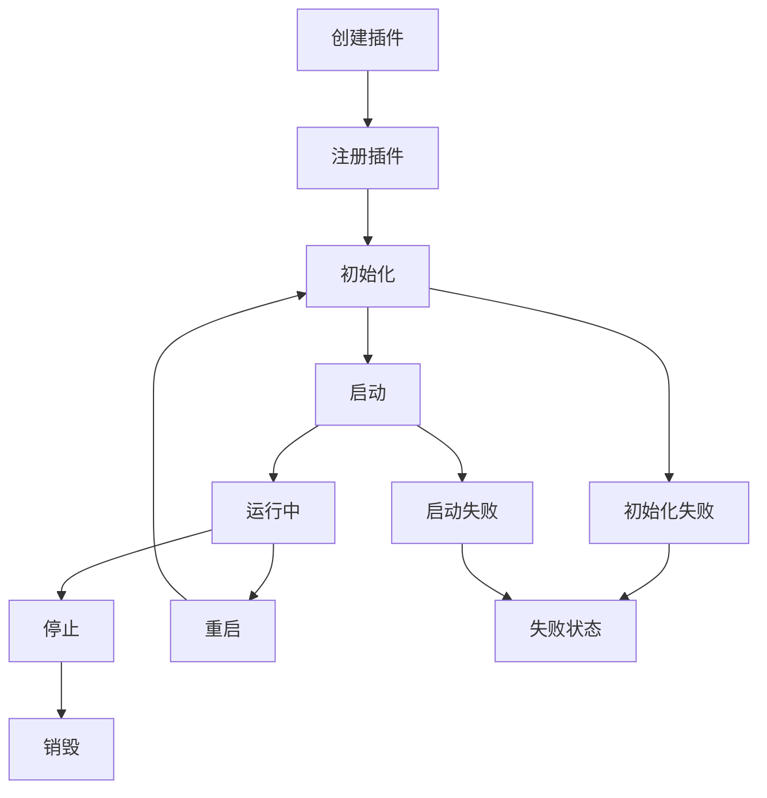

# 🚀 分布式服务插件化框架

[](https://golang.org)
[](LICENSE)
[]()

一个现代化的**分布式服务插件化框架**，支持动态插件管理、事件驱动通信、定时任务调度和微服务架构。框架将传统的单体服务转换为高度模块化的插件系统，提供强大的扩展能力和灵活的部署方案。

## 📋 目录

- [核心特性](#-核心特性)
- [架构设计](#-架构设计)
- [快速开始](#-快速开始)
- [插件系统](#-插件系统)
- [定时任务调度器](#-定时任务调度器)
- [API文档](#-api文档)
- [使用示例](#-使用示例)
- [部署指南](#-部署指南)
- [贡献指南](#-贡献指南)

## ✨ 核心特性

### 🧩 插件化架构
- **动态插件管理**: 运行时加载、卸载、重启插件
- **依赖解析**: 自动处理插件依赖关系和启动顺序
- **生命周期管理**: 完整的插件生命周期控制
- **接口抽象**: 统一的插件接口设计

### 📡 事件驱动通信
- **异步事件总线**: 插件间松耦合通信
- **事件订阅发布**: 支持多种事件类型和处理器
- **实时通知**: 插件状态变化实时推送

### ⏰ 定时任务调度
- **多种调度方式**: Cron表达式、间隔时间、一次性任务
- **任务状态管理**: 运行、暂停、恢复、取消等操作
- **执行统计**: 运行次数、失败次数、性能监控
- **事件集成**: 任务执行状态通过事件系统通知

### 🌐 HTTP管理接口
- **RESTful API**: 完整的插件和任务管理接口
- **实时监控**: 插件状态、任务执行情况查询
- **Web控制台**: 友好的管理界面

### 🔧 服务组件集成
- **Redis Cluster**: 分布式缓存服务
- **Apache Kafka**: 消息队列服务
- **Etcd**: 配置中心和服务发现
- **监控指标**: Prometheus集成
- **链路追踪**: OpenTelemetry支持

## 🏗️ 架构设计

```
┌─────────────────────────────────────────────────────────────┐
│                    插件化服务框架                                │
├─────────────────────────────────────────────────────────────┤
│  HTTP API     │  事件总线     │  任务调度器    │  插件管理器    │
├─────────────────────────────────────────────────────────────┤
│                        插件注册表                               │
├─────────────────────────────────────────────────────────────┤
│  Redis        │  Kafka       │  Etcd        │  自定义插件     │
│  插件          │  插件         │  插件         │               │
├─────────────────────────────────────────────────────────────┤
│  HTTP传输      │  gRPC传输     │  WebSocket   │  消息队列      │
├─────────────────────────────────────────────────────────────┤
│           认证授权  │  限流保护  │  监控指标  │  链路追踪          │
└─────────────────────────────────────────────────────────────┘
```

### 核心组件

| 组件 | 功能 | 描述 |
|------|------|------|
| **Plugin Manager** | 插件管理 | 插件生命周期管理、依赖解析 |
| **Event Bus** | 事件通信 | 异步事件发布订阅机制 |
| **Task Scheduler** | 任务调度 | Cron/间隔/一次性任务调度 |
| **Plugin Registry** | 插件注册 | 插件注册表和服务发现 |
| **Config Provider** | 配置管理 | 插件配置管理和热更新 |
| **Plugin Factory** | 插件工厂 | 动态创建插件实例 |

## 🚀 快速开始

### 环境要求

- Go 1.23+
- Redis (可选)
- Kafka (可选)
- Etcd (可选)

### 安装运行

```bash
# 1. 克隆项目
git clone https://github.com/qiaojinxia/distributed-service
cd distributed-service

# 2. 安装依赖
go mod download

# 3. 运行演示程序
cd examples/plugin_demo
go build -v
./plugin_demo
```

### 访问服务

启动成功后，可以访问以下地址：

- **主页**: http://localhost:8080/demo
- **插件管理**: http://localhost:8080/plugins/status
- **任务调度**: http://localhost:8080/scheduler/tasks
- **任务演示**: http://localhost:8080/demo/scheduler

## 📖 框架基础使用

本框架提供了完整的分布式服务基础设施，支持HTTP REST API、gRPC服务、统一日志记录、配置管理等核心功能。

### 🚀 最简单的开始

```go
package main

import (
    "github.com/qiaojinxia/distributed-service/framework"
)

func main() {
    // 零配置启动 - 自动检测环境配置
    framework.Start()
}
```

### 🌐 HTTP服务

#### 基础HTTP服务

```go
package main

import (
    "context"
    "github.com/gin-gonic/gin"
    "github.com/qiaojinxia/distributed-service/framework"
    "github.com/qiaojinxia/distributed-service/framework/logger"
)

func main() {
    err := framework.New().
        Port(8080).                    // 设置端口
        Name("my-api-service").        // 服务名称
        Version("v1.0.0").            // 版本号
        Mode("debug").                // 运行模式 (debug/release/test)
        OnlyHTTP().                   // 只启用HTTP服务
        HTTP(setupRoutes).            // 注册路由
        BeforeStart(func(ctx context.Context) error {
            logger.GetLogger().Info("🔧 服务初始化中...")
            return nil
        }).
        AfterStart(func(ctx context.Context) error {
            logger.GetLogger().Info("✅ HTTP服务启动完成!")
            logger.GetLogger().Info("🌐 访问地址: http://localhost:8080")
            return nil
        }).
        Run()
    
    if err != nil {
        logger.GetLogger().Fatal("服务启动失败", logger.Any("error", err))
    }
}

// 设置路由
func setupRoutes(r interface{}) {
    router := r.(*gin.Engine)
    
    // 健康检查
    router.GET("/health", func(c *gin.Context) {
        c.JSON(200, gin.H{
            "status": "ok",
            "service": "my-api-service",
            "version": "v1.0.0",
        })
    })
    
    // API路由组
    api := router.Group("/api/v1")
    {
        api.GET("/users", getUserList)
        api.GET("/users/:id", getUserByID)
        api.POST("/users", createUser)
        api.PUT("/users/:id", updateUser)
        api.DELETE("/users/:id", deleteUser)
    }
}

func getUserList(c *gin.Context) {
    c.JSON(200, gin.H{
        "users": []gin.H{
            {"id": 1, "name": "Alice", "email": "alice@example.com"},
            {"id": 2, "name": "Bob", "email": "bob@example.com"},
        },
        "total": 2,
    })
}

func getUserByID(c *gin.Context) {
    id := c.Param("id")
    c.JSON(200, gin.H{
        "id": id,
        "name": "User " + id,
        "email": "user" + id + "@example.com",
    })
}

func createUser(c *gin.Context) {
    // 处理用户创建逻辑
    c.JSON(201, gin.H{"message": "User created successfully"})
}

func updateUser(c *gin.Context) {
    // 处理用户更新逻辑
    id := c.Param("id")
    c.JSON(200, gin.H{"message": "User " + id + " updated successfully"})
}

func deleteUser(c *gin.Context) {
    // 处理用户删除逻辑
    id := c.Param("id")
    c.JSON(200, gin.H{"message": "User " + id + " deleted successfully"})
}
```

#### 快速Web服务

```go
// 使用便捷方法启动Web服务
framework.Web(8080, func(r *gin.Engine) {
    r.GET("/", func(c *gin.Context) {
        c.JSON(200, gin.H{"message": "Hello World!"})
    })
    
    r.GET("/api/status", func(c *gin.Context) {
        c.JSON(200, gin.H{"status": "running"})
    })
})
```

### 🔌 gRPC服务

#### 基础gRPC服务

```go
package main

import (
    "context"
    "github.com/qiaojinxia/distributed-service/framework"
    "github.com/qiaojinxia/distributed-service/framework/logger"
    "google.golang.org/grpc"
)

func main() {
    err := framework.New().
        Port(8080).                     // HTTP端口 (用于健康检查等)
        Name("my-grpc-service").        // 服务名称
        Version("v1.0.0").             // 版本号
        Mode("debug").                 // 运行模式
        OnlyGRPC().                    // 只启用gRPC服务
        GRPC(setupGRPCServices).       // 注册gRPC服务
        BeforeStart(func(ctx context.Context) error {
            logger.GetLogger().Info("🔧 gRPC服务初始化中...")
            return nil
        }).
        AfterStart(func(ctx context.Context) error {
            logger.GetLogger().Info("✅ gRPC服务启动完成!")
            logger.GetLogger().Info("🔌 gRPC监听地址: localhost:9093")
            return nil
        }).
        Run()
    
    if err != nil {
        logger.GetLogger().Fatal("gRPC服务启动失败", logger.Any("error", err))
    }
}

// 设置gRPC服务
func setupGRPCServices(s interface{}) {
    server := s.(*grpc.Server)
    
    // 注册自定义gRPC服务
    // pb.RegisterUserServiceServer(server, &userService{})
    // pb.RegisterOrderServiceServer(server, &orderService{})
    
    logger.GetLogger().Info("🔌 gRPC服务注册完成")
    logger.GetLogger().Info("  ✅ HealthCheck服务 (自动注册)")
    logger.GetLogger().Info("  ✅ Server Reflection (自动注册)")
}
```

#### 快速微服务

```go
// 使用便捷方法启动微服务
framework.Micro(9000, func(s *grpc.Server) {
    // 注册你的gRPC服务
    // pb.RegisterMyServiceServer(s, &myServiceImpl{})
    
    log.Println("🔌 微服务注册完成")
})
```

### 🔄 HTTP + gRPC 双服务

```go
package main

import (
    "context"
    "github.com/gin-gonic/gin"
    "github.com/qiaojinxia/distributed-service/framework"
    "github.com/qiaojinxia/distributed-service/framework/logger"
    "google.golang.org/grpc"
)

func main() {
    err := framework.New().
        Port(8080).                     // HTTP端口
        Name("full-service").           // 服务名称
        Version("v1.0.0").             // 版本号
        Mode("debug").                 // 运行模式
        EnableAll().                   // 启用所有服务 (HTTP + gRPC + Metrics + Tracing)
        HTTP(setupHTTPRoutes).         // 注册HTTP路由
        GRPC(setupGRPCServices).       // 注册gRPC服务
        BeforeStart(func(ctx context.Context) error {
            logger.GetLogger().Info("🔧 初始化完整服务...")
            return nil
        }).
        AfterStart(func(ctx context.Context) error {
            log := logger.GetLogger()
            log.Info("✅ 完整服务启动完成!")
            log.Info("🌐 HTTP服务: http://localhost:8080")
            log.Info("🔌 gRPC服务: localhost:9093")
            log.Info("📊 健康检查: http://localhost:8080/health")
            log.Info("📈 监控指标: http://localhost:9092/metrics")
            return nil
        }).
        Run()
    
    if err != nil {
        logger.GetLogger().Fatal("完整服务启动失败", logger.Any("error", err))
    }
}

func setupHTTPRoutes(r interface{}) {
    router := r.(*gin.Engine)
    
    // 健康检查
    router.GET("/health", func(c *gin.Context) {
        c.JSON(200, gin.H{
            "status": "ok",
            "services": gin.H{
                "http": "running",
                "grpc": "running",
            },
        })
    })
    
    // REST API
    api := router.Group("/api/v1")
    {
        api.GET("/users", func(c *gin.Context) {
            // 可以调用gRPC服务获取数据
            c.JSON(200, gin.H{"users": []string{"alice", "bob"}})
        })
    }
}

func setupGRPCServices(s interface{}) {
    server := s.(*grpc.Server)
    
    // 注册业务gRPC服务
    // pb.RegisterUserServiceServer(server, &userServiceImpl{})
    
    logger.GetLogger().Info("🔌 gRPC服务注册完成")
}
```

### 📋 统一日志系统

框架提供了统一的结构化日志系统，自动包含时间戳、日志级别、来源信息等。

#### 基础日志使用

```go
package main

import (
    "github.com/qiaojinxia/distributed-service/framework/logger"
)

func main() {
    // 获取全局logger实例
    log := logger.GetLogger()
    
    // 基础日志记录
    log.Info("应用程序启动")
    log.Warn("这是一个警告消息")
    log.Error("发生了错误")
    
    // 结构化日志 - 推荐方式
    log.Info("用户登录", 
        logger.String("user_id", "12345"),
        logger.String("ip", "192.168.1.1"),
        logger.Int("attempts", 3))
    
    // 错误日志
    err := errors.New("数据库连接失败")
    log.Error("数据库操作失败", 
        logger.Any("error", err),
        logger.String("operation", "user_query"),
        logger.Duration("timeout", 5*time.Second))
    
    // 致命错误（会退出程序）
    log.Fatal("无法启动服务", logger.Any("error", err))
}
```

#### 日志级别

```go
// 支持的日志级别
log.Debug("调试信息")    // 开发环境详细信息
log.Info("信息日志")     // 一般信息
log.Warn("警告日志")     // 警告信息
log.Error("错误日志")    // 错误信息
log.Fatal("致命错误")    // 致命错误，程序退出
```

#### 上下文日志

```go
import (
    "context"
    "github.com/qiaojinxia/distributed-service/framework/logger"
)

func businessHandler(ctx context.Context) {
    // 从上下文获取logger
    log := logger.GetLogger()
    
    // 带上下文的日志记录
    log.Info("处理业务请求", 
        logger.String("request_id", "req-123"),
        logger.String("user_id", "user-456"))
    
    // 在函数中传递context
    processOrder(ctx, "order-789")
}

func processOrder(ctx context.Context, orderID string) {
    log := logger.GetLogger()
    
    log.Info("开始处理订单", 
        logger.String("order_id", orderID))
    
    // 业务逻辑...
    
    log.Info("订单处理完成", 
        logger.String("order_id", orderID),
        logger.String("status", "completed"))
}
```

### ⚙️ 配置文件使用

框架支持YAML格式的配置文件，提供丰富的配置选项。

#### 基础配置文件 (`config/config.yaml`)

```yaml
# 服务配置
server:
  port: 8080                        # HTTP端口
  mode: debug                       # 运行模式: debug/release/test
  name: my-service                  # 服务名称
  version: v1.0.0                   # 服务版本
  tags: "api,microservice"          # 服务标签

# gRPC配置  
grpc:
  port: 9093                        # gRPC端口
  max_recv_msg_size: 4194304        # 最大接收消息大小 (4MB)
  max_send_msg_size: 4194304        # 最大发送消息大小 (4MB)
  connection_timeout: "5s"          # 连接超时
  enable_reflection: true           # 启用反射服务
  enable_health_check: true         # 启用健康检查

# 日志配置
logger:
  level: debug                      # 日志级别: debug/info/warn/error
  encoding: console                 # 编码格式: console/json
  output_path: stdout               # 输出路径: stdout/文件路径

# JWT认证配置
jwt:
  secret_key: "your-secret-key"     # JWT密钥
  issuer: "my-service"              # 发行者

# MySQL数据库配置
mysql:
  host: localhost
  port: 3306
  username: root
  password: root
  database: my_database
  charset: utf8mb4
  max_idle_conns: 10               # 最大空闲连接数
  max_open_conns: 100              # 最大打开连接数

# Redis配置
redis:
  host: localhost
  port: 6379
  password: ""                     # Redis密码
  db: 0                           # 数据库编号
  pool_size: 100                  # 连接池大小

# 监控指标配置
metrics:
  enabled: true                    # 启用监控
  prometheus_port: 9092           # Prometheus端口

# 链路追踪配置
tracing:
  service_name: my-service        # 服务名称
  service_version: v1.0.0         # 服务版本
  environment: development        # 环境
  enabled: true                   # 启用追踪
  exporter_type: stdout           # 导出器类型: stdout/otlp
  sample_ratio: 1.0               # 采样比例 (0.0-1.0)
```

#### 使用配置文件

```go
package main

import (
    "github.com/qiaojinxia/distributed-service/framework"
)

func main() {
    err := framework.New().
        Config("config/config.yaml").   // 指定配置文件
        AutoDetect().                   // 自动检测环境变量
        HTTP(setupRoutes).
        Run()
    
    if err != nil {
        log.Fatal(err)
    }
}
```

#### 环境变量配置

```bash
# 通过环境变量覆盖配置
export PORT=8080
export GIN_MODE=release
export CONFIG_PATH=config/production.yaml
export APP_NAME=my-production-service

# 启动应用
./my-service
```

### 🔧 组件配置选项

#### 选择性启用组件

```go
// 最小化配置 - 只启用必要组件
framework.New().
    Port(8080).
    OnlyHTTP().                    // 只启用HTTP
    DisableComponents("metrics", "tracing").  // 禁用指定组件
    HTTP(setupRoutes).
    Run()

// 自定义组件配置
framework.New().
    Port(8080).
    Enable("http", "metrics").     // 只启用HTTP和监控
    Disable("grpc", "tracing").    // 禁用gRPC和追踪
    HTTP(setupRoutes).
    Run()

// 完整功能
framework.New().
    Port(8080).
    EnableAll().                   // 启用所有组件
    HTTP(setupRoutes).
    GRPC(setupGRPCServices).
    Run()
```

#### 开发模式快捷配置

```go
// 开发模式
framework.New().
    Dev().                         // 8080端口，debug模式
    HTTP(setupRoutes).
    Run()

// 生产模式  
framework.New().
    Prod().                        // 80端口，release模式
    HTTP(setupRoutes).
    Run()

// 测试模式
framework.New().
    Test().                        // 随机端口，test模式，只启用HTTP
    HTTP(setupRoutes).
    Run()
```

### 🛠️ 生命周期钩子

框架提供了完整的生命周期钩子，方便在不同阶段执行自定义逻辑。

```go
err := framework.New().
    Port(8080).
    // 启动前回调
    BeforeStart(func(ctx context.Context) error {
        log.Info("🔧 执行启动前初始化...")
        // 初始化数据库连接
        // 加载配置文件
        // 预热缓存
        return nil
    }).
    // 启动后回调
    AfterStart(func(ctx context.Context) error {
        log.Info("✅ 服务启动完成!")
        // 注册到服务发现
        // 启动后台任务
        // 发送启动通知
        return nil
    }).
    // 停止前回调
    BeforeStop(func(ctx context.Context) error {
        log.Info("🛑 执行停止前清理...")
        // 完成正在处理的请求
        // 保存状态数据
        return nil
    }).
    // 停止后回调
    AfterStop(func(ctx context.Context) error {
        log.Info("✅ 服务已完全停止")
        // 清理资源
        // 发送停止通知
        return nil
    }).
    HTTP(setupRoutes).
    Run()
```

### 📊 健康检查和监控

框架自动提供健康检查和监控端点：

```bash
# 健康检查
curl http://localhost:8080/health

# 响应示例
{
  "status": "ok",
  "service": "my-service",
  "version": "v1.0.0",
  "timestamp": "2024-01-20T10:00:00Z",
  "components": {
    "database": "healthy",
    "redis": "healthy",
    "grpc": "healthy"
  }
}

# Prometheus监控指标
curl http://localhost:9092/metrics
```

### 🔍 最佳实践

#### 1. 项目结构建议

```
my-service/
├── main.go                 # 主程序入口
├── config/
│   ├── config.yaml         # 配置文件
│   ├── development.yaml    # 开发环境配置
│   └── production.yaml     # 生产环境配置
├── internal/
│   ├── handler/            # HTTP处理器
│   ├── service/            # 业务逻辑
│   ├── repository/         # 数据访问层
│   └── model/              # 数据模型
├── proto/                  # gRPC协议文件
├── scripts/                # 部署脚本
└── docs/                   # 文档
```

#### 2. 错误处理

```go
import (
    "errors"
    "github.com/qiaojinxia/distributed-service/framework/logger"
)

func businessLogic() error {
    log := logger.GetLogger()
    
    if err := doSomething(); err != nil {
        // 记录详细错误信息
        log.Error("业务处理失败", 
            logger.Any("error", err),
            logger.String("operation", "user_create"),
            logger.String("user_id", "12345"))
        
        // 返回用户友好的错误
        return errors.New("用户创建失败，请稍后重试")
    }
    
    log.Info("业务处理成功")
    return nil
}
```

#### 3. 性能优化

```go
// 启用所有性能相关组件
framework.New().
    Port(8080).
    Mode("release").               // 生产模式
    EnableAll().                   // 启用所有组件
    WithMetrics(&metrics.Config{   // 自定义监控配置
        Enabled: true,
        Port:    9092,
    }).
    WithTracing(&tracing.Config{   // 自定义追踪配置
        SampleRatio: 0.1,          // 10%采样率
    }).
    HTTP(setupRoutes).
    Run()
```

这个框架基础使用指南涵盖了从最简单的启动到复杂的双服务配置，帮助开发者快速上手并构建生产级的分布式服务。

## 🧩 插件系统

### 插件类型

```go
// 基础插件接口
type Plugin interface {
    Name() string
    Version() string
    Initialize(ctx context.Context, config Config) error
    Start(ctx context.Context) error
    Stop(ctx context.Context) error
    Status() Status
    Health() HealthStatus
}

// 服务插件 - 提供具体业务服务
type ServicePlugin interface {
    Plugin
    GetService() interface{}
    GetEndpoints() []Endpoint
}

// 中间件插件 - 提供中间件功能
type MiddlewarePlugin interface {
    Plugin
    GetMiddleware() interface{}
    Priority() int
}
```

### 创建自定义插件

```go
// 1. 使用构建器创建插件
plugin := plugin.NewServicePluginBuilder("my-service", "v1.0.0", "自定义服务").
    Dependencies([]string{"logger", "config"}).
    Service(myService).
    Endpoint(plugin.Endpoint{
        Name: "health",
        Path: "/my-service/health",
        Method: "GET",
    }).
    OnInitialize(func(ctx context.Context, config plugin.Config) error {
        // 初始化逻辑
        return nil
    }).
    OnStart(func(ctx context.Context) error {
        // 启动逻辑
        return nil
    }).
    Build()

// 2. 注册插件
manager.GetRegistry().Register(plugin)

// 3. 启动插件
manager.StartPlugin("my-service")
```

### 插件生命周期



## ⏰ 定时任务调度器

### 支持的调度类型

```go
// 1. Cron表达式调度
task := plugin.NewTaskBuilder("cron-task", "定时任务").
    Cron("@every 1m").               // 每分钟执行
    Handler(myTaskHandler).
    Build()

// 2. 间隔时间调度
task := plugin.NewTaskBuilder("interval-task", "间隔任务").
    Interval(30 * time.Second).      // 每30秒执行
    MaxRuns(10).                     // 最多执行10次
    Handler(myTaskHandler).
    Build()

// 3. 一次性延时任务
task := plugin.NewTaskBuilder("once-task", "一次性任务").
    Once(10 * time.Second).          // 10秒后执行一次
    Handler(myTaskHandler).
    Build()

// 调度任务
scheduler.ScheduleTask(task)
```

### 任务状态管理

| 状态 | 描述 |
|------|------|
| `pending` | 等待执行 |
| `running` | 正在执行 |
| `paused` | 已暂停 |
| `completed` | 已完成 |
| `failed` | 执行失败 |
| `canceled` | 已取消 |

### 任务控制

```go
// 暂停任务
scheduler.PauseTask("task-id")

// 恢复任务
scheduler.ResumeTask("task-id")

// 取消任务
scheduler.CancelTask("task-id")

// 查询任务状态
task := scheduler.GetTask("task-id")
fmt.Printf("任务状态: %s, 执行次数: %d", task.Status, task.RunCount)
```

## 📖 API文档

### 插件管理API

```http
# 获取所有插件状态
GET /plugins/status

# 重启指定插件
POST /plugins/{name}/restart

# 发布测试事件
POST /plugins/events/test
```

### 任务调度API

```http
# 获取所有任务
GET /scheduler/tasks

# 创建新任务
POST /scheduler/tasks
Content-Type: application/json

{
  "id": "my-task",
  "name": "我的任务",
  "description": "任务描述",
  "schedule": {
    "type": "interval",
    "interval": "30s",
    "max_runs": 10
  }
}

# 获取指定任务
GET /scheduler/tasks/{id}

# 暂停任务
POST /scheduler/tasks/{id}/pause

# 恢复任务  
POST /scheduler/tasks/{id}/resume

# 取消任务
POST /scheduler/tasks/{id}/cancel

# 获取调度器状态
GET /scheduler/status
```

### 响应格式

```json
{
  "code": 200,
  "message": "success",
  "data": {
    "task": {
      "id": "my-task",
      "name": "我的任务",
      "status": "running",
      "run_count": 5,
      "created_at": "2024-01-01T10:00:00Z",
      "next_run_at": "2024-01-01T10:01:00Z"
    }
  }
}
```

## 💡 使用示例

### 基础使用

```go
package main

import (
    "github.com/qiaojinxia/distributed_service/framework/plugin"
    "time"
)

func main() {
    // 1. 创建插件管理器
    manager := plugin.NewDefaultManager(&plugin.ManagerConfig{
        EnableDependencyCheck: true,
        HealthCheckInterval:   30 * time.Second,
    })
    
    // 2. 设置日志
    logger := plugin.NewSimplePluginLogger("demo")
    manager.SetLogger(logger)
    
    // 3. 创建并启动调度器插件
    schedulerPlugin := plugin.NewSchedulerPlugin()
    manager.GetRegistry().Register(schedulerPlugin)
    manager.StartPlugin("scheduler")
    
    // 4. 创建定时任务
    task := plugin.NewTaskBuilder("log-task", "日志任务").
        Cron("@every 1m").
        Handler(func(ctx context.Context, task *plugin.Task) error {
            log.Printf("定时任务执行: %s", task.Name)
            return nil
        }).
        Build()
    
    // 5. 调度任务
    schedulerPlugin.ScheduleTask(task)
    
    // 6. 启动HTTP服务
    framework.Web(8080)
}
```

### 事件监听示例

```go
// 监听插件事件
manager.SubscribeEvent(plugin.EventPluginStarted, func(event *plugin.Event) error {
    log.Printf("插件启动: %s", event.Source)
    return nil
})

// 监听任务事件
manager.SubscribeEvent("scheduler.task.completed", func(event *plugin.Event) error {
    if taskEvent, ok := event.Data.(*plugin.TaskEvent); ok {
        log.Printf("任务完成: %s", taskEvent.TaskName)
    }
    return nil
})
```

### 集成现有服务

```go
// Redis集群插件
redisPlugin := plugin.NewRedisClusterPlugin()
config := plugin.NewConfigBuilder().
    Set("addrs", []string{"localhost:7000", "localhost:7001"}).
    SetInt("pool_size", 10).
    Build()

manager.GetRegistry().Register(redisPlugin)
manager.InitializePlugin("redis-cluster", config)
manager.StartPlugin("redis-cluster")

// 获取Redis客户端
redisClient := redisPlugin.GetClient()
```

## 📦 部署指南

### Docker部署

```dockerfile
FROM golang:1.23-alpine AS builder

WORKDIR /app
COPY . .
RUN go mod download
RUN go build -o plugin-demo examples/plugin_demo/main.go

FROM alpine:latest
RUN apk --no-cache add ca-certificates
WORKDIR /root/
COPY --from=builder /app/plugin-demo .
EXPOSE 8080
CMD ["./plugin-demo"]
```

### Docker Compose

```yaml
version: '3.8'
services:
  plugin-framework:
    build: .
    ports:
      - "8080:8080"
    environment:
      - GO_ENV=production
    depends_on:
      - redis
      - kafka
      - etcd
  
  redis:
    image: redis:7-alpine
    ports:
      - "6379:6379"
  
  kafka:
    image: confluentinc/cp-kafka:latest
    ports:
      - "9092:9092"
    environment:
      KAFKA_ZOOKEEPER_CONNECT: zookeeper:2181
      KAFKA_ADVERTISED_LISTENERS: PLAINTEXT://localhost:9092
  
  etcd:
    image: quay.io/coreos/etcd:latest
    ports:
      - "2379:2379"
```

### Kubernetes部署

```yaml
apiVersion: apps/v1
kind: Deployment
metadata:
  name: plugin-framework
spec:
  replicas: 3
  selector:
    matchLabels:
      app: plugin-framework
  template:
    metadata:
      labels:
        app: plugin-framework
    spec:
      containers:
      - name: plugin-framework
        image: your-registry/plugin-framework:latest
        ports:
        - containerPort: 8080
        env:
        - name: GO_ENV
          value: "production"
---
apiVersion: v1
kind: Service
metadata:
  name: plugin-framework-service
spec:
  selector:
    app: plugin-framework
  ports:
  - protocol: TCP
    port: 80
    targetPort: 8080
  type: LoadBalancer
```

## 🔧 配置说明

### 插件管理器配置

```go
config := &plugin.ManagerConfig{
    EnableAutoLoad:        true,                    // 启用自动加载
    AutoLoadDirectory:     "./plugins",             // 插件目录
    EnableHotSwap:         true,                    // 启用热插拔
    HealthCheckInterval:   30 * time.Second,        // 健康检查间隔
    EnableDependencyCheck: true,                    // 启用依赖检查
    MaxStartupTime:        60 * time.Second,        // 最大启动时间
    EnableMetrics:         true,                    // 启用指标收集
}
```

### 环境变量

| 变量名 | 说明 | 默认值 |
|--------|------|--------|
| `GO_ENV` | 运行环境 | `development` |
| `HTTP_PORT` | HTTP服务端口 | `8080` |
| `LOG_LEVEL` | 日志级别 | `info` |
| `REDIS_ADDR` | Redis地址 | `localhost:6379` |
| `KAFKA_BROKERS` | Kafka地址 | `localhost:9092` |
| `ETCD_ENDPOINTS` | Etcd地址 | `localhost:2379` |

## 🧪 测试

```bash
# 运行所有测试
go test ./...

# 运行特定测试
go test ./framework/plugin/...

# 运行基准测试
go test -bench=. ./framework/plugin/...

# 运行测试并生成覆盖率报告
go test -cover ./...
```

## 📈 性能监控

框架集成了Prometheus监控指标：

```go
// 插件指标
plugin_count_total                    // 插件总数
plugin_status{name,status}           // 插件状态
plugin_startup_duration_seconds      // 插件启动时间

// 任务调度指标  
scheduler_tasks_total                // 任务总数
scheduler_task_executions_total      // 任务执行次数
scheduler_task_duration_seconds      // 任务执行时间
scheduler_task_failures_total        // 任务失败次数
```

访问 http://localhost:8080/metrics 查看监控指标。

## 🔐 安全考虑

- **插件隔离**: 插件运行在独立的上下文中
- **权限控制**: 插件权限管理和访问控制
- **输入验证**: 严格的输入参数验证
- **错误处理**: 完善的错误处理和恢复机制

## 🗺️ 路线图

- [ ] **v2.0.0**
  - [ ] 插件热加载和动态更新
  - [ ] 图形化管理界面
  - [ ] 更多Cron表达式支持
  - [ ] 插件市场和分发机制

- [ ] **v2.1.0**
  - [ ] 分布式任务调度
  - [ ] 任务依赖管理
  - [ ] 更强的插件隔离
  - [ ] 性能优化

## 🤝 贡献指南

我们欢迎各种形式的贡献！

1. **Fork** 项目
2. 创建特性分支 (`git checkout -b feature/AmazingFeature`)
3. 提交更改 (`git commit -m 'Add some AmazingFeature'`)
4. 推送到分支 (`git push origin feature/AmazingFeature`)
5. 开启 **Pull Request**

### 开发指南

- 遵循 [Go Code Review Comments](https://github.com/golang/go/wiki/CodeReviewComments)
- 编写测试用例
- 更新文档
- 运行 `go fmt` 和 `go vet`

## 📄 许可证

本项目基于 MIT 许可证 - 查看 [LICENSE](LICENSE) 文件了解详情。

## 🙏 致谢

感谢所有贡献者和以下开源项目：

- [Gin](https://github.com/gin-gonic/gin) - HTTP Web框架
- [Go-Redis](https://github.com/go-redis/redis) - Redis客户端
- [Sarama](https://github.com/Shopify/sarama) - Kafka客户端  
- [Etcd](https://github.com/etcd-io/etcd) - 分布式键值存储
- [Prometheus](https://prometheus.io/) - 监控系统
- [OpenTelemetry](https://opentelemetry.io/) - 可观测性框架

## 📞 联系我们

- **项目主页**: https://github.com/your-org/distributed-service
- **问题反馈**: https://github.com/your-org/distributed-service/issues
- **讨论区**: https://github.com/your-org/distributed-service/discussions

---

⭐ 如果这个项目对您有帮助，请给我们一个星标！ 