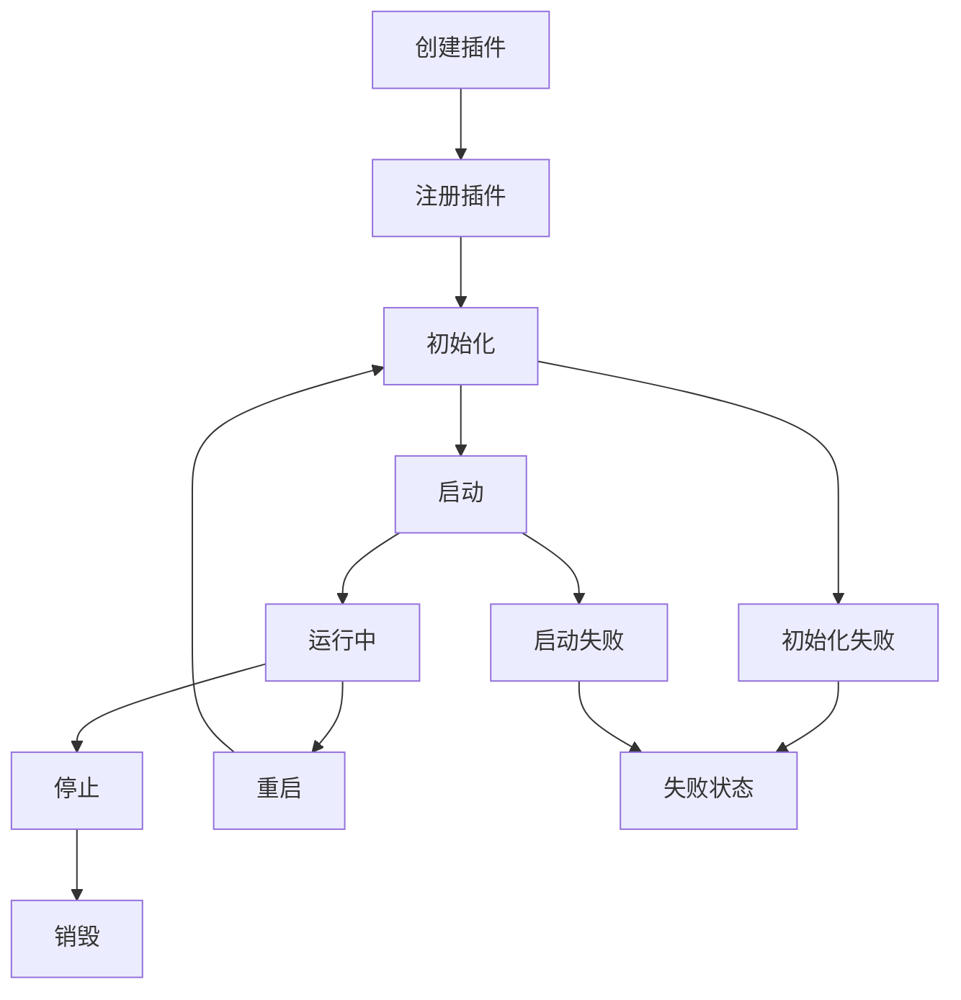

# 🚀 分布式服务插件化框架

[](https://golang.org)
[](LICENSE)
[]()

一个现代化的**分布式服务插件化框架**，支持动态插件管理、事件驱动通信、定时任务调度和微服务架构。框架将传统的单体服务转换为高度模块化的插件系统，提供强大的扩展能力和灵活的部署方案。

## 📋 目录

- [核心特性](#-核心特性)
- [架构设计](#-架构设计)
- [快速开始](#-快速开始)
- [插件系统](#-插件系统)
- [定时任务调度器](#-定时任务调度器)
- [API文档](#-api文档)
- [使用示例](#-使用示例)
- [部署指南](#-部署指南)
- [贡献指南](#-贡献指南)

## ✨ 核心特性

### 🧩 插件化架构
- **动态插件管理**: 运行时加载、卸载、重启插件
- **依赖解析**: 自动处理插件依赖关系和启动顺序
- **生命周期管理**: 完整的插件生命周期控制
- **接口抽象**: 统一的插件接口设计

### 📡 事件驱动通信
- **异步事件总线**: 插件间松耦合通信
- **事件订阅发布**: 支持多种事件类型和处理器
- **实时通知**: 插件状态变化实时推送

### ⏰ 定时任务调度
- **多种调度方式**: Cron表达式、间隔时间、一次性任务
- **任务状态管理**: 运行、暂停、恢复、取消等操作
- **执行统计**: 运行次数、失败次数、性能监控
- **事件集成**: 任务执行状态通过事件系统通知

### 🌐 HTTP管理接口
- **RESTful API**: 完整的插件和任务管理接口
- **实时监控**: 插件状态、任务执行情况查询
- **Web控制台**: 友好的管理界面

### 🔧 服务组件集成
- **Redis Cluster**: 分布式缓存服务
- **Apache Kafka**: 消息队列服务
- **Etcd**: 配置中心和服务发现
- **监控指标**: Prometheus集成
- **链路追踪**: OpenTelemetry支持

## 🏗️ 架构设计

```
┌─────────────────────────────────────────────────────────────┐
│                    插件化服务框架                                │
├─────────────────────────────────────────────────────────────┤
│  HTTP API     │  事件总线     │  任务调度器    │  插件管理器    │
├─────────────────────────────────────────────────────────────┤
│                        插件注册表                               │
├─────────────────────────────────────────────────────────────┤
│  Redis        │  Kafka       │  Etcd        │  自定义插件     │
│  插件          │  插件         │  插件         │               │
├─────────────────────────────────────────────────────────────┤
│  HTTP传输      │  gRPC传输     │  WebSocket   │  消息队列      │
├─────────────────────────────────────────────────────────────┤
│           认证授权  │  限流保护  │  监控指标  │  链路追踪          │
└─────────────────────────────────────────────────────────────┘
```

### 核心组件

| 组件 | 功能 | 描述 |
|------|------|------|
| **Plugin Manager** | 插件管理 | 插件生命周期管理、依赖解析 |
| **Event Bus** | 事件通信 | 异步事件发布订阅机制 |
| **Task Scheduler** | 任务调度 | Cron/间隔/一次性任务调度 |
| **Plugin Registry** | 插件注册 | 插件注册表和服务发现 |
| **Config Provider** | 配置管理 | 插件配置管理和热更新 |
| **Plugin Factory** | 插件工厂 | 动态创建插件实例 |

## 🚀 快速开始

### 环境要求

- Go 1.23+
- Redis (可选)
- Kafka (可选)
- Etcd (可选)

### 安装运行

```bash
# 1. 克隆项目
git clone https://github.com/qiaojinxia/distributed-service
cd distributed-service

# 2. 安装依赖
go mod download

# 3. 运行演示程序
cd examples/plugin_demo
go build -v
./plugin_demo
```

### 访问服务

启动成功后，可以访问以下地址：

- **主页**: http://localhost:8080/demo
- **插件管理**: http://localhost:8080/plugins/status
- **任务调度**: http://localhost:8080/scheduler/tasks
- **任务演示**: http://localhost:8080/demo/scheduler

## 🧩 插件系统

### 插件类型

```go
// 基础插件接口
type Plugin interface {
    Name() string
    Version() string
    Initialize(ctx context.Context, config Config) error
    Start(ctx context.Context) error
    Stop(ctx context.Context) error
    Status() Status
    Health() HealthStatus
}

// 服务插件 - 提供具体业务服务
type ServicePlugin interface {
    Plugin
    GetService() interface{}
    GetEndpoints() []Endpoint
}

// 中间件插件 - 提供中间件功能
type MiddlewarePlugin interface {
    Plugin
    GetMiddleware() interface{}
    Priority() int
}
```

### 创建自定义插件

```go
// 1. 使用构建器创建插件
plugin := plugin.NewServicePluginBuilder("my-service", "v1.0.0", "自定义服务").
    Dependencies([]string{"logger", "config"}).
    Service(myService).
    Endpoint(plugin.Endpoint{
        Name: "health",
        Path: "/my-service/health",
        Method: "GET",
    }).
    OnInitialize(func(ctx context.Context, config plugin.Config) error {
        // 初始化逻辑
        return nil
    }).
    OnStart(func(ctx context.Context) error {
        // 启动逻辑
        return nil
    }).
    Build()

// 2. 注册插件
manager.GetRegistry().Register(plugin)

// 3. 启动插件
manager.StartPlugin("my-service")
```

### 插件生命周期



## ⏰ 定时任务调度器

### 支持的调度类型

```go
// 1. Cron表达式调度
task := plugin.NewTaskBuilder("cron-task", "定时任务").
    Cron("@every 1m").               // 每分钟执行
    Handler(myTaskHandler).
    Build()

// 2. 间隔时间调度
task := plugin.NewTaskBuilder("interval-task", "间隔任务").
    Interval(30 * time.Second).      // 每30秒执行
    MaxRuns(10).                     // 最多执行10次
    Handler(myTaskHandler).
    Build()

// 3. 一次性延时任务
task := plugin.NewTaskBuilder("once-task", "一次性任务").
    Once(10 * time.Second).          // 10秒后执行一次
    Handler(myTaskHandler).
    Build()

// 调度任务
scheduler.ScheduleTask(task)
```

### 任务状态管理

| 状态 | 描述 |
|------|------|
| `pending` | 等待执行 |
| `running` | 正在执行 |
| `paused` | 已暂停 |
| `completed` | 已完成 |
| `failed` | 执行失败 |
| `canceled` | 已取消 |

### 任务控制

```go
// 暂停任务
scheduler.PauseTask("task-id")

// 恢复任务
scheduler.ResumeTask("task-id")

// 取消任务
scheduler.CancelTask("task-id")

// 查询任务状态
task := scheduler.GetTask("task-id")
fmt.Printf("任务状态: %s, 执行次数: %d", task.Status, task.RunCount)
```

## 📖 API文档

### 插件管理API

```http
# 获取所有插件状态
GET /plugins/status

# 重启指定插件
POST /plugins/{name}/restart

# 发布测试事件
POST /plugins/events/test
```

### 任务调度API

```http
# 获取所有任务
GET /scheduler/tasks

# 创建新任务
POST /scheduler/tasks
Content-Type: application/json

{
  "id": "my-task",
  "name": "我的任务",
  "description": "任务描述",
  "schedule": {
    "type": "interval",
    "interval": "30s",
    "max_runs": 10
  }
}

# 获取指定任务
GET /scheduler/tasks/{id}

# 暂停任务
POST /scheduler/tasks/{id}/pause

# 恢复任务  
POST /scheduler/tasks/{id}/resume

# 取消任务
POST /scheduler/tasks/{id}/cancel

# 获取调度器状态
GET /scheduler/status
```

### 响应格式

```json
{
  "code": 200,
  "message": "success",
  "data": {
    "task": {
      "id": "my-task",
      "name": "我的任务",
      "status": "running",
      "run_count": 5,
      "created_at": "2024-01-01T10:00:00Z",
      "next_run_at": "2024-01-01T10:01:00Z"
    }
  }
}
```

## 💡 使用示例

### 基础使用

```go
package main

import (
    "github.com/qiaojinxia/distributed_service/framework/plugin"
    "time"
)

func main() {
    // 1. 创建插件管理器
    manager := plugin.NewDefaultManager(&plugin.ManagerConfig{
        EnableDependencyCheck: true,
        HealthCheckInterval:   30 * time.Second,
    })
    
    // 2. 设置日志
    logger := plugin.NewSimplePluginLogger("demo")
    manager.SetLogger(logger)
    
    // 3. 创建并启动调度器插件
    schedulerPlugin := plugin.NewSchedulerPlugin()
    manager.GetRegistry().Register(schedulerPlugin)
    manager.StartPlugin("scheduler")
    
    // 4. 创建定时任务
    task := plugin.NewTaskBuilder("log-task", "日志任务").
        Cron("@every 1m").
        Handler(func(ctx context.Context, task *plugin.Task) error {
            log.Printf("定时任务执行: %s", task.Name)
            return nil
        }).
        Build()
    
    // 5. 调度任务
    schedulerPlugin.ScheduleTask(task)
    
    // 6. 启动HTTP服务
    framework.Web(8080)
}
```

### 事件监听示例

```go
// 监听插件事件
manager.SubscribeEvent(plugin.EventPluginStarted, func(event *plugin.Event) error {
    log.Printf("插件启动: %s", event.Source)
    return nil
})

// 监听任务事件
manager.SubscribeEvent("scheduler.task.completed", func(event *plugin.Event) error {
    if taskEvent, ok := event.Data.(*plugin.TaskEvent); ok {
        log.Printf("任务完成: %s", taskEvent.TaskName)
    }
    return nil
})
```

### 集成现有服务

```go
// Redis集群插件
redisPlugin := plugin.NewRedisClusterPlugin()
config := plugin.NewConfigBuilder().
    Set("addrs", []string{"localhost:7000", "localhost:7001"}).
    SetInt("pool_size", 10).
    Build()

manager.GetRegistry().Register(redisPlugin)
manager.InitializePlugin("redis-cluster", config)
manager.StartPlugin("redis-cluster")

// 获取Redis客户端
redisClient := redisPlugin.GetClient()
```

## 📦 部署指南

### Docker部署

```dockerfile
FROM golang:1.23-alpine AS builder

WORKDIR /app
COPY . .
RUN go mod download
RUN go build -o plugin-demo examples/plugin_demo/main.go

FROM alpine:latest
RUN apk --no-cache add ca-certificates
WORKDIR /root/
COPY --from=builder /app/plugin-demo .
EXPOSE 8080
CMD ["./plugin-demo"]
```

### Docker Compose

```yaml
version: '3.8'
services:
  plugin-framework:
    build: .
    ports:
      - "8080:8080"
    environment:
      - GO_ENV=production
    depends_on:
      - redis
      - kafka
      - etcd
  
  redis:
    image: redis:7-alpine
    ports:
      - "6379:6379"
  
  kafka:
    image: confluentinc/cp-kafka:latest
    ports:
      - "9092:9092"
    environment:
      KAFKA_ZOOKEEPER_CONNECT: zookeeper:2181
      KAFKA_ADVERTISED_LISTENERS: PLAINTEXT://localhost:9092
  
  etcd:
    image: quay.io/coreos/etcd:latest
    ports:
      - "2379:2379"
```

### Kubernetes部署

```yaml
apiVersion: apps/v1
kind: Deployment
metadata:
  name: plugin-framework
spec:
  replicas: 3
  selector:
    matchLabels:
      app: plugin-framework
  template:
    metadata:
      labels:
        app: plugin-framework
    spec:
      containers:
      - name: plugin-framework
        image: your-registry/plugin-framework:latest
        ports:
        - containerPort: 8080
        env:
        - name: GO_ENV
          value: "production"
---
apiVersion: v1
kind: Service
metadata:
  name: plugin-framework-service
spec:
  selector:
    app: plugin-framework
  ports:
  - protocol: TCP
    port: 80
    targetPort: 8080
  type: LoadBalancer
```

## 🔧 配置说明

### 插件管理器配置

```go
config := &plugin.ManagerConfig{
    EnableAutoLoad:        true,                    // 启用自动加载
    AutoLoadDirectory:     "./plugins",             // 插件目录
    EnableHotSwap:         true,                    // 启用热插拔
    HealthCheckInterval:   30 * time.Second,        // 健康检查间隔
    EnableDependencyCheck: true,                    // 启用依赖检查
    MaxStartupTime:        60 * time.Second,        // 最大启动时间
    EnableMetrics:         true,                    // 启用指标收集
}
```

### 环境变量

| 变量名 | 说明 | 默认值 |
|--------|------|--------|
| `GO_ENV` | 运行环境 | `development` |
| `HTTP_PORT` | HTTP服务端口 | `8080` |
| `LOG_LEVEL` | 日志级别 | `info` |
| `REDIS_ADDR` | Redis地址 | `localhost:6379` |
| `KAFKA_BROKERS` | Kafka地址 | `localhost:9092` |
| `ETCD_ENDPOINTS` | Etcd地址 | `localhost:2379` |

## 🧪 测试

```bash
# 运行所有测试
go test ./...

# 运行特定测试
go test ./framework/plugin/...

# 运行基准测试
go test -bench=. ./framework/plugin/...

# 运行测试并生成覆盖率报告
go test -cover ./...
```

## 📈 性能监控

框架集成了Prometheus监控指标：

```go
// 插件指标
plugin_count_total                    // 插件总数
plugin_status{name,status}           // 插件状态
plugin_startup_duration_seconds      // 插件启动时间

// 任务调度指标  
scheduler_tasks_total                // 任务总数
scheduler_task_executions_total      // 任务执行次数
scheduler_task_duration_seconds      // 任务执行时间
scheduler_task_failures_total        // 任务失败次数
```

访问 http://localhost:8080/metrics 查看监控指标。

## 🔐 安全考虑

- **插件隔离**: 插件运行在独立的上下文中
- **权限控制**: 插件权限管理和访问控制
- **输入验证**: 严格的输入参数验证
- **错误处理**: 完善的错误处理和恢复机制

## 🗺️ 路线图

- [ ] **v2.0.0**
  - [ ] 插件热加载和动态更新
  - [ ] 图形化管理界面
  - [ ] 更多Cron表达式支持
  - [ ] 插件市场和分发机制

- [ ] **v2.1.0**
  - [ ] 分布式任务调度
  - [ ] 任务依赖管理
  - [ ] 更强的插件隔离
  - [ ] 性能优化

## 🤝 贡献指南

我们欢迎各种形式的贡献！

1. **Fork** 项目
2. 创建特性分支 (`git checkout -b feature/AmazingFeature`)
3. 提交更改 (`git commit -m 'Add some AmazingFeature'`)
4. 推送到分支 (`git push origin feature/AmazingFeature`)
5. 开启 **Pull Request**

### 开发指南

- 遵循 [Go Code Review Comments](https://github.com/golang/go/wiki/CodeReviewComments)
- 编写测试用例
- 更新文档
- 运行 `go fmt` 和 `go vet`

## 📄 许可证

本项目基于 MIT 许可证 - 查看 [LICENSE](LICENSE) 文件了解详情。

## 🙏 致谢

感谢所有贡献者和以下开源项目：

- [Gin](https://github.com/gin-gonic/gin) - HTTP Web框架
- [Go-Redis](https://github.com/go-redis/redis) - Redis客户端
- [Sarama](https://github.com/Shopify/sarama) - Kafka客户端  
- [Etcd](https://github.com/etcd-io/etcd) - 分布式键值存储
- [Prometheus](https://prometheus.io/) - 监控系统
- [OpenTelemetry](https://opentelemetry.io/) - 可观测性框架

## 📞 联系我们

- **项目主页**: https://github.com/your-org/distributed-service
- **问题反馈**: https://github.com/your-org/distributed-service/issues
- **讨论区**: https://github.com/your-org/distributed-service/discussions

---

⭐ 如果这个项目对您有帮助，请给我们一个星标！ 